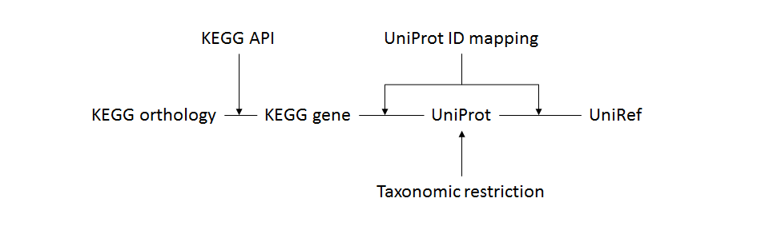
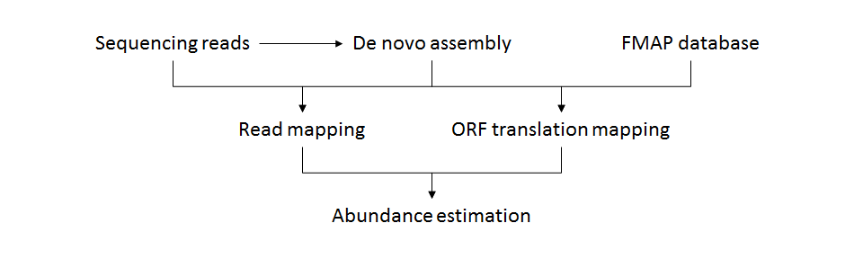

# FMAP

Functional Mapping and Analysis Pipeline for metagenomics and metatranscriptomics studies

Some example results are available at the homepage: https://qbrc.swmed.edu/FMAP/.


## Features

* FMAP provides a more sensible reference protein sequence database based on [UniRef](http://www.uniprot.org/help/uniref).

* Identification of differentially-abundant genes [KEGG Orthology](http://www.genome.jp/kegg/ko.html)

* Mapping differentially-abundant genes to pathways and modules ([KEGG Pathway](http://www.genome.jp/kegg/pathway.html) and [KEGG Module](http://www.genome.jp/kegg/module.html))

* Mapping differentially-abundant genes to operons ([ODB (v3)](http://operondb.jp))


## Requirements

* [Perl](https://www.perl.org) - scripting language

* [R](http://www.r-project.org) - statistical computing

* [Statistics::R](http://search.cpan.org/~fangly/Statistics-R-0.33/lib/Statistics/R.pm) - Perl interface with the R statistical program
  * Use CPAN to install the module  
   ```
   perl -MCPAN -e 'install Statistics::R'
   ```
  * or download the source and compile manually  
   ```
   wget 'http://search.cpan.org/CPAN/authors/id/F/FA/FANGLY/Statistics-R-0.33.tar.gz'
   tar zxf Statistics-R-0.33.tar.gz
   cd Statistics-R-0.33
   perl Makefile.PL
   make
   make test
   make install
   ```

* Mapping program providing BLASTX search of sequencing reads: [DIAMOND](http://ab.inf.uni-tuebingen.de/software/diamond/) or [USEARCH](http://www.drive5.com/usearch/)

* Linux commands: [```wget```](https://www.gnu.org/software/wget/), ```cat```, ```sort```

* [Bio::DB::Taxonomy](http://search.cpan.org/dist/BioPerl/Bio/DB/Taxonomy.pm) - Access to a taxonomy database (which is required only if you want to build a custom database.)


## Command usages

* **FMAP_database.pl**
  * Process
    
  * Input
    1. [UniRef](http://www.uniprot.org/help/uniref) sequence identity (50, 90, or 100)
    2. (optional) [NCBI taxonomy](https://www.ncbi.nlm.nih.gov/taxonomy) IDs (integer)
  * Require [Bio::DB::Taxonomy](http://search.cpan.org/dist/BioPerl/Bio/DB/Taxonomy.pm).
  * The following data files will be downloaded through FTP connection. If you have a problem in the FTP connection, please download the files through another method and copy them into "FMAP_data" directory before executing "FMAP_database.pl" command.  
    ftp://ftp.ncbi.nlm.nih.gov/pub/taxonomy/taxdump.tar.gz  
    ftp://ftp.uniprot.org/pub/databases/uniprot/current_release/knowledgebase/idmapping/idmapping.dat.gz  
    ftp://ftp.uniprot.org/pub/databases/uniprot/uniref/uniref100/uniref100.fasta.gz  
    or ftp://ftp.uniprot.org/pub/databases/uniprot/uniref/uniref90/uniref90.fasta.gz  
    or ftp://ftp.uniprot.org/pub/databases/uniprot/uniref/uniref50/uniref50.fasta.gz  
  * Require HTTP connection for KEGG API.
```
Usage:   perl FMAP_database.pl [options] 50|90|100 [NCBI_TaxID [...]]

Options: -h       display this help message
         -s       switch database
         -r       redownload data
```

* **FMAP_prepare.pl**
```
Usage:   perl FMAP_prepare.pl [options]

Options: -h       display this help message
         -r       redownload data
         -m FILE  executable file path of mapping program, "diamond" or "usearch" [diamond]
         -k       download prebuilt KEGG files
```

* **FMAP_assembly.pl**
  * Process
    
    * Read mapping: nucleotide sequence alignment using [BWA](http://bio-bwa.sourceforge.net)
    * ORF mapping: protein sequence alignment using [DIAMOND](http://ab.inf.uni-tuebingen.de/software/diamond/)
  * Input
    1. Prefix of output files
    2. De novo assembled sequences in FASTA format
      * A FASTA file can be generated by metagenome assemblers such as [SPAdes](http://cab.spbu.ru/software/spades/) and [MetaVelvet](http://metavelvet.dna.bio.keio.ac.jp).
      * A FASTA file containing target genome sequences can be input instead.
    3. Whole metagenomic/metatranscriptomic shotgun sequencing reads in FASTQ or FASTA format
      * Multiple read files can be specified.
      * Paired-end read files must be specified comma-separated like "input.R1.fastq,input.R2.fastq".
      * The read files can be compressed by gzip.
  * Output
    1. Prefix.region.abundance.txt (abundances of ORF regions mapping to KEGG orthologies)
    2. Prefix.abundance.txt (abundances of KEGG orthologies)
```
Usage:   perl FMAP_assembly.pl [options] output.prefix assembly.fasta input1.fastq|input1.R1.fastq,input1.R2.fastq [input2.fastq|input2.R1.fastq,input2.R2.fastq [...]] > summary.txt

Options: -h       display this help message
         -p INT   number of threads [1]
         -e FLOAT maximum e-value to report alignments for "diamond" [10]
         -t DIR   directory for temporary files [$TMPDIR or /tmp]
         -c STR   codon and translation e.g. ATG=M [NCBI genetic code 11 (Bacterial, Archaeal and Plant Plastid)]
         -s STR   start codons [GTG,ATG,CTG,TTG,ATA,ATC,ATT]
         -l INT   minimum translation length [10]
         -m FLOAT minimum coverage [0.8]
         -q INT   minimum mapping quality [0]
         -s STR   strand specificity, "f" or "r"
```

* **FMAP_assembly_operon.pl**
  * Input: FMAP_assembly.region.txt (ORF regions mapping to KEGG orthologies generated by FMAP_assembly)
  * Output: FMAP_assembly_operon.txt ([ODB (v3)](http://operondb.jp) known operons consisting of orthologies located together on an assembled contig/scaffold/transcript)
```
Usage:   perl FMAP_assembly_operon.pl [options] FMAP_assembly.region.txt > FMAP_assembly_operon.txt

Options: -h       display this help message
         -a       print single-gene operons as well
```

* **FMAP_download.pl**
```
Usage:   perl FMAP_download.pl [options]

Options: -h       display this help message
         -m FILE  executable file path of mapping program, "diamond" or "usearch" [diamond]
         -k       download prebuilt KEGG files
         -x       download only KEGG files
```

* **FMAP_mapping.pl**
  * Input: whole metagenomic (or metatranscriptomic) shotgun sequencing reads in FASTQ or FASTA format
  * Output: best-match hits in NCBI BLAST ‑m8 (= NCBI BLAST+ ‑outfmt 6) format
```
Usage:   perl FMAP_mapping.pl [options] input1.fastq|input1.fasta [input2.fastq|input2.fasta [...]] > blastx_hits.txt

Options: -h       display this help message
         -m FILE  executable file path of mapping program, "diamond" or "usearch" [diamond]
         -p INT   number of threads [1]
         -e FLOAT maximum e-value to report alignments for "diamond" [0.001]
         -i FLOAT minimum identity for "usearch_global" [0.8]
         -t DIR   directory for temporary files [$TMPDIR or /tmp]
```

* **FMAP_quantification.pl**
  * Input: output of "FMAP_mapping.pl"
  * Output: abundances (RPKM) of KEGG orthologies
  * Output columns: [KEGG Orthology](http://www.genome.jp/kegg/ko.html) ID, orthology definition, abundance (RPKM)
```
Usage:   perl FMAP_quantification.pl [options] blast_hits1.txt [blast_hits2.txt [...]] > abundance.txt

Options: -h       display this help message
         -c       use CPM values instead of RPKM values
         -w FILE  tab-delimited text file with the first column having read names and the second column having the weights
```

* **FMAP_table.pl**
  * Input: outputs of "FMAP_quantification.pl"
  * Output: abundance table
  * Output columns: [KEGG Orthology](http://www.genome.jp/kegg/ko.html) ID, orthology definition, abundance of sample1, abundance of sample2, ...
```
Usage:   perl FMAP_table.pl [options] [name1=]abundance1.txt [[name2=]abundance2.txt [...]] > abundance_table.txt

Options: -h       display this help message
         -c       use raw counts instead of RPKM values
```

* **FMAP_comparison.pl**
  * Input: output of "FMAP_table.pl", sample group information
  * Output: comparison test statistics for orthologies
  * Output columns: [KEGG Orthology](http://www.genome.jp/kegg/ko.html) ID, orthology definition, log2 fold change, p-value, FDR-adjusted p-value, filter (pass or fail)
```
Usage:   perl FMAP_comparison.pl [options] abundance_table.txt control1[,control2[...]] case1[,case2[...]] [...] > orthology_test_stat.txt

Options: -h       display this help message
         -t STR   statistical test for comparing sample groups, "kruskal", "anova", "poisson", "quasipoisson", "metagenomeSeq" [kruskal]
         -f FLOAT fold change cutoff [2]
         -p FLOAT p-value cutoff [0.05]
         -a FLOAT FDR-adjusted p-value cutoff [1]
```

* **FMAP_pathway.pl**
  * Input: output of "FMAP_comparison.pl"
  * Output: pathways enriched in filter-passed orthologies
  * Output columns: [KEGG Pathway](http://www.genome.jp/kegg/pathway.html) ID, pathway definition, orthology count, coverage, p-value, [KEGG Orthology](http://www.genome.jp/kegg/ko.html) IDs with colors
  * [KEGG Orthology](http://www.genome.jp/kegg/ko.html) IDs with colors: input of [KEGG Pathway](http://www.genome.jp/kegg/pathway.html) mapping (http://www.kegg.jp/kegg/tool/map_pathway2.html)
```
Usage:   perl FMAP_pathway.pl [options] orthology_test_stat.txt > pathway.txt

Options: -h       display this help message
```

* **FMAP_module.pl**
  * Input: output of "FMAP_comparison.pl"
  * Output: modules enriched in filter-passed orthologies
  * Output columns: [KEGG Module](http://www.genome.jp/kegg/module.html) ID, module definition, orthology count, coverage, p-value, [KEGG Orthology](http://www.genome.jp/kegg/ko.html) IDs with colors
  * [KEGG Orthology](http://www.genome.jp/kegg/ko.html) IDs with colors: input of [KEGG Pathway](http://www.genome.jp/kegg/pathway.html) mapping (http://www.kegg.jp/kegg/tool/map_pathway2.html)
```
Usage:   perl FMAP_module.pl [options] orthology_test_stat.txt > module.txt

Options: -h       display this help message
```

* **FMAP_operon.pl**
  * Input: output of "FMAP_comparison.pl"
  * Output: operons consisting of filter-passed orthologies
  * Output columns: [ODB (v3)](http://operondb.jp) known operon IDs, operon definition, log2 fold change, [KEGG Orthology](http://www.genome.jp/kegg/ko.html) IDs, [KEGG Pathway](http://www.genome.jp/kegg/pathway.html) IDs
```
Usage:   perl FMAP_operon.pl [options] orthology_test_stat.txt > operon.txt

Options: -h       display this help message
         -a       print single-gene operons as well
```

* **FMAP_plot.pl**
  * Input: output of "FMAP_pathway.pl", "FMAP_module.pl", or "FMAP_operon.pl"
  * Output: PNG format image file of p-value plot
```
Usage:   perl FMAP_plot.pl [options] pathway.txt|module.txt|operon.txt plot.pdf

Options: -h       display this help message
         -w INT   plot width [12]
         -h INT   plot height [8]
         -l FLOAT plot left margin [20]
         -p FLOAT p-value cutoff [0.05]
         -c FLOAT coverage cutoff [0 for pathway, 1 for module and operons]
         -d       do not print definition
```

* **FMAP_all.pl**
  * Input: configuration table file
  * Input columns: group (control, ...), sample name, input file of "FMAP_mapping.pl"
  * Output: script file including all FMAP commands, all FMAP outputs
```
Usage:   perl FMAP_all.pl [options] input.config [output_prefix]

Options: -h       display this help message
         -s       generate a script, but not execute it
         -m FILE  mapping: executable file path of mapping program, "diamond" or "usearch" [diamond]
         -t INT   mapping: number of threads [1]
         -c STR   comparison: statistical test for comparing sample groups, "kruskal", "anova", "poisson", "quasipoisson", "metagenomeSeq" [kruskal]
         -f FLOAT comparison: fold change cutoff [2]
         -p FLOAT comparison: p-value cutoff [0.05]
         -a FLOAT comparison: FDR-adjusted p-value cutoff [1]
```


## Command orders

* Use the prebuilt database (UniRef90 and bacteria/archaea/fungi)
  1. FMAP_download.pl
  2. FMAP_mapping.pl
  3. FMAP_quantification.pl
  4. FMAP_table.pl
  5. FMAP_comparison.pl
  6. FMAP_pathway.pl
  7. FMAP_module.pl
  8. FMAP_operon.pl

* Use a custom database (you can define UniRef and taxonomy.)
  1. FMAP_database.pl
  2. FMAP_prepare.pl
  3. FMAP_mapping.pl
  4. FMAP_quantification.pl
  5. FMAP_table.pl
  6. FMAP_comparison.pl
  7. FMAP_pathway.pl
  8. FMAP_module.pl
  9. FMAP_operon.pl


## Citation

Kim J, Kim MS, Koh AY, Xie Y, Zhan X.
"FMAP: Functional Mapping and Analysis Pipeline for metagenomics and metatranscriptomics studies"
BMC Bioinformatics. 2016 Oct 10;17(1):420.
PMID: [27724866](https://www.ncbi.nlm.nih.gov/pubmed/27724866)
